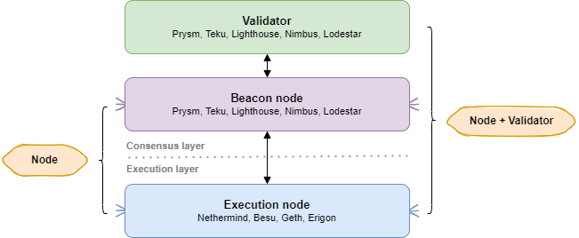
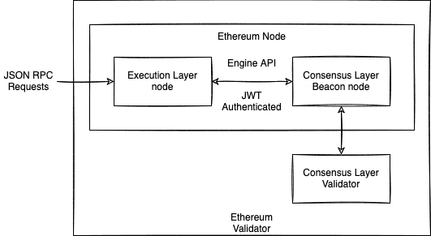

# 🔱 EtherForge: Empowering ETH Validators

Set of CLI tools for setup Ethereum Validator.

## Prerequisites

* Review how staking works and the hardware requirements
* An [Ubuntu](https://docs.ethstaker.cc/ethstaker-knowledge-base/tutorials/installing-linux) installation.
  * Tested working with Ubuntu 22.04 LTS
  * Also appears compatible with Linux Mint 21.2, Debian 12

## TODO

* Update `mainnet`
